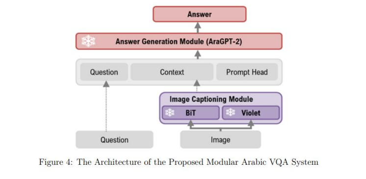
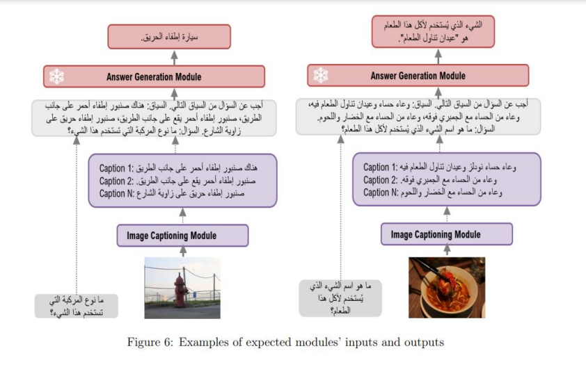

# arabic-visual-question-answering


## Architecture







## How to Use aravqa

### Example Usage in Google Colab
Interactive Jupyter notebooks are provided to demonstrate aravqa capabilities. You can open these notebooks in Google Colab:

- [Arabic VQA Demo](arabic-visual-question-answering/blob/main/notebooks/demo.ipynb) [](https://colab.research.google.com/github/Mahmood-Anaam/arabic-visual-question-answering/blob/main/notebooks/demo.ipynb)

- [Arabic VQA Demo](arabic-visual-question-answering/blob/main/notebooks/demo.ipynb) [](https://colab.research.google.com/github/Mahmood-Anaam/arabic-visual-question-answering/blob/main/notebooks/demo.ipynb)


### Installation

حسناً، إليك بنية ملفات مكتبة `AraVQA`  مع شرح لكيفية استخدامها:

```bash

!pip install git+https://github.com/Mahmood-Anaam/Violet.git
!pip install git+https://github.com/Mahmood-Anaam/BiT-ImageCaptioning.git

!pip install git+https://github.com/Mahmood-Anaam/arabic-visual-question-answering.git

```

```bash
!git clone https://github.com/Mahmood-Anaam/arabic-visual-question-answering.git
%cd arabic-visual-question-answering
!pip install -e . -q
```


**بنية الملفات:**

```
aravqa/
├── core/
│   ├── __init__.py
│   ├── config.py          # إعدادات قابلة للتعديل (مسارات، خيارات، إلخ)
│   ├── pipeline.py       # يدير تسلسل معالجة البيانات
│   ├── utils.py           # دوال مساعدة عامة (مثل تحميل الصور، معالجة النصوص)
│   └── exceptions.py     # تعريف استثناءات مخصصة
├── modules/
│   ├── __init__.py
│   ├── captioning/
│   │   ├── __init__.py
│   │   ├── base.py         # واجهة لتوليد التعليقات (Abstract Base Class)
│   │   ├── bit_captioner.py
│   │   └── violet_captioner.py
│   ├── question_answering/
│   │   ├── __init__.py
│   │   ├── base.py         # واجهة للإجابة على الأسئلة (Abstract Base Class)
│   │   └── gemini_answerer.py
│   └── evaluation/
│       ├── __init__.py
│       ├── base.py         # واجهة لتقييم الأداء (Abstract Base Class)
│       └── bleu_evaluator.py
├── datasets/
│   ├── __init__.py
│   ├── vqa_v2_dataset.py  # تحميل بيانات VQA-v2
│   └── okvqa_dataset.py   # تحميل بيانات OK-VQA
├── experiments/
│   ├── __init__.py
│   ├── ablation_study.py # مثال لتجربة الإزالة التدريجية
│   └── ...              # تجارب إضافية
├── tests/
│   ├── __init__.py
│   ├── test_image_processing.py
│   ├── test_captioning.py
│   ├── test_question_answering.py
│   └── test_evaluation.py
└── aravqa.py             # نقطة الدخول الرئيسية


```

**كيفية استخدام المكتبة:**

1. **التثبيت:**  `pip install aravqa`

2. **الاستيراد:**

```python

from aravqa.core import pipeline, config
from aravqa.modules.image_processing import OpenCVProcessor #مثال
from aravqa.modules.captioning import BITCaptioner #مثال
from aravqa.modules.question_answering import AraGPT2Answerer #مثال
from aravqa.modules.evaluation import BLEUEvaluator #مثال
from aravqa.datasets import VQA_V2Dataset #مثال

```

3. **تهيئة  `config.py`:**  يجب  تعيين  المسارات  والخيارات  في  هذا  الملف.

4. **إنشاء  `Pipeline`:**

```python
cfg = config.load_config("config.yaml") # أو من خلال معلمات
image_processor = OpenCVProcessor(cfg)
captioner = BITCaptioner(cfg)
qa_model = AraGPT2Answerer(cfg)
evaluator = BLEUEvaluator(cfg)

my_pipeline = pipeline.Pipeline(image_processor, captioner, qa_model, evaluator)
```

5. **تحميل  البيانات:**

```python
dataset = VQA_V2Dataset(cfg)
image, question, answer = dataset[0] # مثال على عنصر بيانات
```

6. **تشغيل  النظام:**

```python
results = my_pipeline.process(image, question)
score = evaluator.evaluate(results, answer)
print(f"Answer: {results['answer']}, BLEU Score: {score}")

```

هذا مثال مبسط.  يمكنك  تعديل  سلسلة  المعالجة (`pipeline`)  لاستخدام  مكونات  مختلفة  (مثل  `PillowProcessor`  أو  `VioletCaptioner`)  وإجراء  تجارب  مختلفة.  تذكر  أن  تُضيف  معالجة  لأخطاء  وإدارة  للسجلات (logging)  في  كودك.  يجب  أن  تُكتب  كل  واجهة  (interface)  كـ `Abstract Base Class`  في  بايثون.


